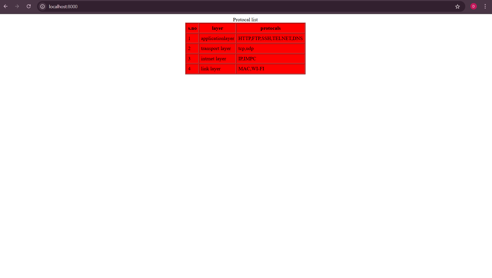
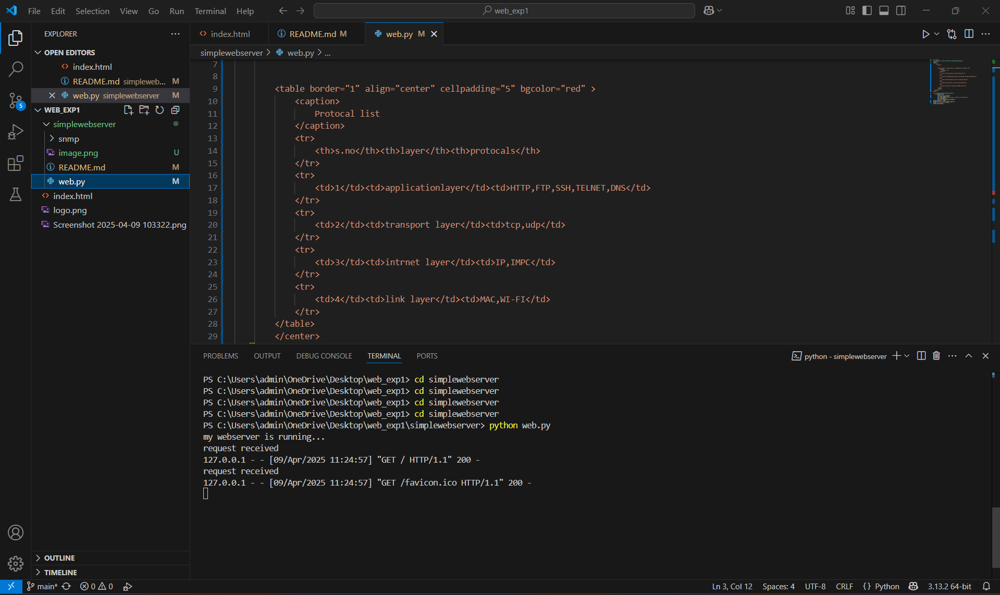

# EX01 Developing a Simple Webserver
## Date:09/04/2025

## AIM:
To develop a simple webserver to serve html pages and display the list of protocols in TCP/IP Protocol Suite.


## DESIGN STEPS:
### Step 1: 
HTML content creation.

### Step 2:
Design of webserver workflow.

### Step 3:
Implementation using Python code.

### Step 4:
Serving the HTML pages.

### Step 5:
Testing the webserver.

## PROGRAM:
```html
<html>
    <body>
        <center>
        
        </center>
        <table border="1" align="center" cellpadding="5" bgcolor="red" >
            <caption>
                Protocal list
            </caption>
            <tr>
                <th>s.no</th><th>layer</th><th>protocals</th>
            </tr>
            <tr>
                <td>1</td><td>applicationlayer</td><td>HTTP,FTP,SSH,TELNET,DNS</td>
            </tr>
            <tr>
                <td>2</td><td>transport layer</td><td>tcp,udp</td>
            </tr>
            <tr>
                <td>3</td><td>intrnet layer</td><td>IP,IMPC</td>
            </tr>
            <tr>
                <td>4</td><td>link layer</td><td>MAC,WI-FI</td>
            </tr>
        </table>
    </body>
</html>


```

## OUTPUT:





## RESULT:
The program for implementing simple webserver is executed successfully.
